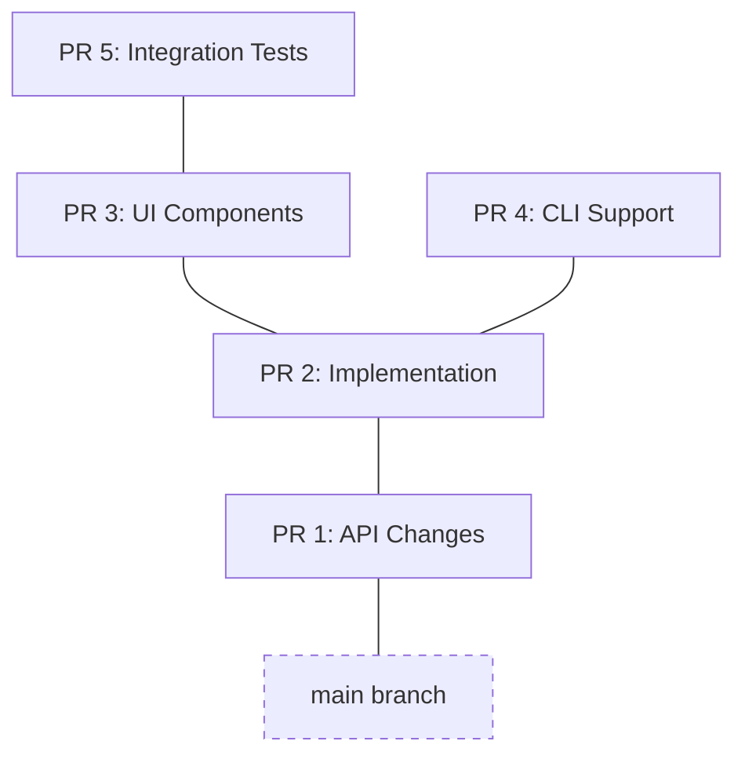

# Stackit

[](https://github.com/getstackit/stackit/actions/workflows/test.yml)

**Stackit** is a command-line tool that makes working with stacked changes fast and intuitive.

## Table of Contents

- [What is Stacking?](#what-is-stacking)
- [Features](#features)
- [Installation](#installation)
- [Getting Started](#getting-started)
- [Command Reference](#command-reference)
- [Common Workflows](#common-workflows)
- [Claude Code Integration](#claude-code-integration)
- [Branch Protection](#frozen--locked-branches)
- [Configuration](#configuration)
- [Troubleshooting](#troubleshooting)
- [Contributing](#contributing)

---

## What is Stacking?

Stacked changes (or "stacked diffs") is a development workflow where you break a large feature into small, focused branches that build on top of each other. Instead of one massive Pull Request, you have a "stack" of smaller PRs. Stacks can be linear (a simple chain of branches) or they can branch out into a tree structure when you need to work on multiple parallel features that share a common base.

### How it helps engineers:

- **Faster Reviews**: Reviewers can process small, 50-line PRs much faster than a single 500-line PR.
- **Parallel Work**: You don't have to wait for a PR to be merged before starting the next part of your feature. Just stack a new branch on top.
- **Incremental Shipping**: Parts of a feature can be merged and deployed as they are approved, reducing the risk of large, complex merges.
- **Cleaner History**: Each PR represents a logical step in your feature's development, making the Git history easier to follow.

### The Stacked Workflow



Stacks naturally form a tree structure—a single branch can have multiple children when you need to work on parallel features. Stackit manages the complexity of this workflow—automatically handling rebases, keeping track of parent-child relationships, and submitting the entire stack to GitHub with a single command.

---

## Features

- 🌳 **Visual branch tree** — See your entire stack at a glance with `stackit log`
- 🔄 **Automatic restacking** — Keep all branches up to date when you rebase or modify a parent
- 📤 **Submit entire stacks** — Push all branches and create/update PRs in one command
- 🔀 **Smart merging** — Merge stacks bottom-up or squash top-down
- 🔧 **Absorb changes** — Automatically amend changes to the right commit in your stack
- 🧭 **Easy navigation** — Move `up`, `down`, `top`, or `bottom` of your stack
- 🧹 **Auto cleanup** — Detect and delete merged branches during `sync`
- 🎯 **Smart scoping** — Associate branches with Jira tickets, Linear IDs, or other logical scopes
- 🔒 **Branch protection** — `lock` or `freeze` branches to prevent accidental modifications
- 🔍 **Branch inspection** — Easily see parent/child relationships with `children` and `parent` commands
- ⚙️ **Advanced configuration** — Customize branch naming patterns and submit behavior
- 🤖 **AI assistant integration** — Generate integration files for Cursor and Claude Code
- 🐙 **GitHub Integration** — Install CI checks to prevent merging locked PRs
- ⚓ **Git Hooks** — Automatically validate branch state before committing with `precommit`
- 📂 **Worktrees** — Work on multiple stacks in parallel with dedicated directories and post-creation hooks

---

## Installation

### Homebrew (macOS and Linux)

```bash
brew install getstackit/tap/stackit
```

After installation, you can use either `stackit` or `st` (short alias).

### Shell Integration (Recommended)

Enable shell integration to automatically change directories when creating worktrees with `stackit create -w`. Add one of the following to your shell configuration:

```bash
# For zsh (~/.zshrc):
eval "$(stackit shell zsh)"

# For bash (~/.bashrc):
eval "$(stackit shell bash)"

# For fish (~/.config/fish/config.fish):
stackit shell fish | source
```

This is separate from shell completions. You likely want both:

```bash
# zsh example:
eval "$(stackit completion zsh)"
eval "$(stackit shell zsh)"
```

---

## Getting Started

### 1. Initialize Stackit
In your repository, run:
```bash
stackit init
```
This detects your trunk branch (usually `main`) and prepares the repo for stacking. You'll be prompted to install optional integrations (GitHub Actions, pre-commit hooks, AI agent files).

### 2. Create your first branch
Stage some changes, then create a branch:
```bash
git add internal/api.go
stackit create add-api -m "feat: add base api"
```

### 3. Stack another branch on top
Make more changes and create another branch:
```bash
git add internal/logic.go
stackit create add-logic -m "feat: implement logic"
```

### 4. Visualize the stack
See your current position in the stack:
```bash
stackit log
```
```
● add-logic ← you are here
│
◯ add-api
│
main
```

Stacks can also branch when you have parallel work:
```
◯ add-tests
│
│ ● add-ui ← you are here
├─┘
◯ add-logic
│
◯ add-api
│
main
```

### 5. Submit your PRs
Submit the entire stack to GitHub:
```bash
stackit submit
```
This pushes both branches and creates two PRs on GitHub, with `add-logic` correctly pointing its base to `add-api`.

### 6. Merge your stack
Once your PRs are approved, merge the entire stack:
```bash
stackit merge          # Interactive wizard
stackit merge next     # Merge bottom PR, then restack
stackit merge squash   # Consolidate into single PR and merge
```
- `stackit merge` launches an interactive wizard to guide you through merging
- `stackit merge next` merges the bottom-most unmerged PR using GitHub automerge, then restacks remaining branches
- `stackit merge squash` consolidates all branches into a single PR for atomic merging

---

## Claude Code Integration

Stackit includes specialized commands designed for Claude Code, providing intelligent automation for common stacking workflows. These commands understand stack context and can perform complex operations with minimal user input.

### Available Claude Commands

| Command | Description | When to Use |
|:---|:---|:---|
| `stack-status` | View current stack state, branch position, and health status | Getting oriented in a complex stack |
| `stack-create [branch-name]` | Create a new stacked branch with intelligent naming and commit messages | Adding a new feature branch to your stack |
| `stack-submit [--stack \| --draft]` | Submit branches as PRs with auto-generated descriptions | Creating or updating pull requests |
| `stack-sync` | Sync with trunk, cleanup merged branches, and restack | Keeping your stack up-to-date with main |
| `stack-restack` | Rebase all branches to ensure proper ancestry | Fixing branch relationships after changes |
| `stack-absorb` | Intelligently absorb working changes into correct commits | Applying fixes across multiple stack branches, with conflict resolution guidance |
| `stack-fix` | Diagnose and fix common stack issues | Resolving compilation errors or structural problems |

### Setting Up Claude Integration

```bash
stackit agent install
```

This creates the necessary integration files for Claude Code to use these specialized commands. The commands are designed to:

- **Understand Context**: Each command analyzes your current stack state and git status
- **Provide Validation**: Commands include quality checks and error handling
- **Guide Through Issues**: When conflicts or errors occur, commands provide step-by-step resolution guidance
- **Ensure Safety**: All commands prioritize data safety and provide undo capabilities

### Example Claude Workflow

```bash
# Claude can help with complex stacking operations
stack-create add-user-auth    # Creates branch with proper commit message
# Make changes...
stack-absorb                 # Intelligently distributes changes across commits
stack-fix                    # Diagnoses and fixes any issues
stack-submit --stack         # Creates/updates all PRs in the stack
```

---

## Command Reference

### Navigation
| Command | Description |
|:---|:---|
| `stackit log` | Display the branch tree |
| `stackit checkout` | Interactive branch switcher |
| `stackit up` / `down` | Move to the child or parent branch |
| `stackit top` / `bottom` | Move to the top or bottom of the stack |
| `stackit trunk` | Return to the main/trunk branch |
| `stackit children` | Show the children of the current branch |
| `stackit parent` | Show the parent of the current branch |

### Branch Management
| Command | Description |
|:---|:---|
| `stackit create [name]` | Create a new branch on top of current (use `-w` to create with worktree) |
| `stackit modify` | Amend the current commit (like `git commit --amend`) |
| `stackit absorb` | Intelligently amend changes to the correct commits in the stack |
| `stackit split` | Split the current branch's commits into multiple branches |
| `stackit squash` | Squash all commits on the current branch |
| `stackit fold` | Merge the current branch into its parent |
| `stackit pop` | Delete current branch but keep its changes in working tree |
| `stackit delete` | Delete the current branch and its metadata |
| `stackit rename [name]` | Rename the current branch and update metadata |
| `stackit scope [name]` | Manage logical scope (Jira ticket, Linear ID) for current branch |
| `stackit lock [branch]` | Lock a branch and its downstack (prevent local changes) |
| `stackit unlock [branch]` | Unlock a branch and its upstack (allow local changes) |
| `stackit freeze [branch]` | Freeze a branch (prevent local changes, local only) |
| `stackit unfreeze [branch]` | Unfreeze a branch |

### Worktree Management
| Command | Description |
|:---|:---|
| `stackit worktree create <name>` | Create a new worktree (use `--open` to auto-cd) |
| `stackit worktree list` | List all managed worktrees |
| `stackit worktree remove <stack>` | Remove a worktree and unregister it |
| `stackit worktree open <stack>` | Open a worktree (auto-cd with shell integration, or print path for `cd $(...)`) |

### Stack Operations
| Command | Description |
|:---|:---|
| `stackit flatten` | Move branches closer to trunk where possible |
| `stackit restack` | Rebase all branches in the stack to ensure proper ancestry |
| `stackit get [branch|PR]` | Sync a stack or specific PR from remote |
| `stackit foreach` | Run a shell command on each branch in the stack (default: upstack) |
| `stackit submit` | Push branches and create/update GitHub PRs (alias: `ss` for `--stack`) |
| `stackit sync` | Pull trunk, delete merged branches, and restack |
| `stackit merge` | Interactive merge wizard (use `merge next` or `merge squash` for non-interactive) |
| `stackit reorder` | Interactively reorder branches in your stack |
| `stackit move` | Rebase a branch (and its children) onto a new parent |
| `stackit pluck` | Extract a single branch from a stack (reparents children to grandparent) |

### Integrations
| Command | Description |
|:---|:---|
| `stackit agent install` | Setup integration files for Cursor and Claude Code |
| `stackit github install` | Install GitHub Action CI checks for branch locking |
| `stackit precommit install` | Install git pre-commit hook for branch state validation |
| `stackit precommit uninstall` | Remove the git pre-commit hook |

### Utilities & System
| Command | Description |
|:---|:---|
| `stackit undo` | Restore the repository to a state before a command |
| `stackit doctor` | Diagnose and fix issues with your stackit setup |
| `stackit info` | Show detailed info about the current branch |
| `stackit track` / `untrack` | Manually start/stop tracking a branch with stackit |
| `stackit config` | Manage stackit configuration |
| `stackit debug` | Dump debugging information about recent commands and stack state |
| `stackit continue` / `abort` | Continue or abort an interrupted operation (like a rebase) |

### Global Flags

These flags are available on all `stackit` commands:

| Flag | Description |
|:---|:---|
| `--cwd <path>` | Working directory in which to perform operations. |
| `--debug` | Write debug output to the terminal. |
| `--interactive` | Enable interactive features like prompts, pagers, and editors. (Default: true) |
| `--no-interactive` | Disable all interactive features. |
| `--verify` | Enable git hooks (pre-commit, etc.). (Default: true) |
| `--no-verify` | Disable git hooks. |
| `--quiet`, `-q` | Minimize output to the terminal. Implies `--no-interactive`. |

---

## Common Workflows

### Updating after Code Review
If you receive feedback on a branch in the middle of your stack:
1. `stackit checkout <branch>` to move to that branch.
2. Make your changes and run `stackit modify`.
3. Run `stackit restack` to update all child branches.
4. Run `stackit submit` to update the PRs on GitHub.

### Using `stackit absorb`
`absorb` is like magic for stacked PRs. If you have small fixes for multiple branches in your stack, just stage them all and run `stackit absorb`. Stackit will figure out which changes belong to which branch and amend them automatically.

### Flattening a Stack
After landing PRs from the middle of a stack, or when you have independent changes that were developed as a chain but don't actually depend on each other, use `flatten` to move branches closer to trunk:
```bash
stackit flatten
```
This analyzes each branch and tests whether it can be rebased directly onto trunk (or closer to it). Branches that depend on changes from their parent will stay in place.

### Syncing with the Main Branch
To keep your stack up-to-date with `main`:
```bash
stackit sync
```
This pulls the latest changes from `main`, deletes branches that have already been merged, and restacks your remaining branches on top of the new `main`.

### Working on Multiple Stacks in Parallel
To work on separate features simultaneously, each in their own directory:
```bash
# Create a new stack with its own worktree
stackit create my-feature -m "feat: start new feature" -w

# This creates:
# - A new branch 'my-feature' tracked by stackit
# - A worktree at ../your-repo-stacks/my-feature/
```
Navigate to the worktree:
```bash
# With shell integration: auto-changes directory
stackit worktree open my-feature

# Without shell integration: use command substitution
cd $(stackit worktree open my-feature)
```
Worktrees are automatically cleaned up during `stackit sync` when their stack is merged.

### Collaborating on Stacks
To work on a stack created by someone else or on another machine:
```bash
# Sync an entire stack by providing a PR number or branch name
stackit get 123
```
By default, `get` **freezes** the fetched branches locally. This prevents accidental local modifications while you build on top of them, without affecting the original author's metadata. Use `stackit unfreeze` if you need to modify them.

---

## Frozen & Locked Branches

Stackit provides two ways to protect branches from accidental modification.

### Frozen Branches (Local)
**Frozen** status is strictly **local** to your machine. It's the recommended way to protect branches you've fetched from others.
- **Use Case**: You want to stack your own work on top of someone else's PRs without accidentally changing their commits.
- **Behavior**: Prevents `modify`, `squash`, `absorb`, and `restack`. `st sync` will update frozen branches by hard-resetting them to their remote tracking branch instead of rebasing.
- **Commands**: `st freeze`, `st unfreeze`

### Locked Branches (Shared)
**Locked** status is **shared** with everyone collaborating on the stack via remote metadata.
- **Use Case**: You want to signal to your team that a set of branches are stable and should not be modified by anyone.
- **Behavior**: Same restrictions as frozen branches, but visible to all users who `st get` or `st sync` the stack.
- **Commands**: `st lock`, `st unlock`

---

### Automation & CI
Stackit is designed to be easily scriptable. Use global flags to control behavior in non-interactive environments:

```bash
# Run stackit on a specific repository from a script
stackit sync --cwd /path/to/repo --no-interactive --no-verify
```

---

## Configuration

Stackit uses a layered configuration system:

1. **Personal settings** (highest priority) — Stored in `.git/config`, not shared
2. **Team settings** — Stored in `.stackit.yaml`, committed and shared with team
3. **Defaults** (lowest priority) — Built-in sensible defaults

This allows teams to define shared settings that individual developers can override locally.

### Configuration Options

| Option | Description | Example |
|:---|:---|:---|
| `trunk` | Primary trunk branch (default: main) | `stackit config set trunk main` |
| `trunks.add` | Add an additional trunk branch | `stackit config set trunks.add develop` |
| `trunks.remove` | Remove an additional trunk branch | `stackit config set trunks.remove develop` |
| `branch.pattern` | Customize how branch names are generated | `stackit config set branch.pattern "{username}/{date}/{message}"` |
| `submit.footer` | Include PR footer linking back to the stack (default: true) | `stackit config set submit.footer false` |
| `merge.method` | Default merge strategy (squash, merge, or rebase) | `stackit config set merge.method squash` |
| `ci.command` | CI validation command to run with `stackit foreach` | `stackit config set ci.command "make test"` |
| `ci.timeout` | CI command timeout in seconds (default: 600) | `stackit config set ci.timeout 300` |
| `undo.depth` | Maximum undo snapshots to retain (default: 10) | `stackit config set undo.depth 20` |
| `worktree.basePath` | Customize where worktrees are created | `stackit config set worktree.basePath "../my-stacks"` |
| `worktree.autoClean` | Auto-remove worktrees for merged stacks during sync (default: true) | `stackit config set worktree.autoClean false` |
| `split.hunkSelector` | Hunk selector mode: tui or git (default: tui) | `stackit config set split.hunkSelector git` |
| `maxConcurrency` | Maximum concurrent validation operations (default: auto) | `stackit config set maxConcurrency 4` |
| `navigation.when` | When to show navigation: always, never, or multiple (default: always) | `stackit config set navigation.when multiple` |
| `navigation.marker` | Symbol marking current PR in stack (default: 👈, max 10 chars) | `stackit config set navigation.marker "<--"` |
| `navigation.location` | Where navigation appears: body, comment, or none (default: body) | `stackit config set navigation.location comment` |
| `navigation.showMerged` | Show merged branch history in navigation (default: false) | `stackit config set navigation.showMerged true` |

### Interactive Configuration
Use the interactive TUI to manage all settings:
```bash
stackit config
```

### List Current Configuration
View all current configuration values:
```bash
stackit config --list
```

### Team Configuration (`.stackit.yaml`)

For team-wide settings, create a `.stackit.yaml` file in your repository root. This file should be committed to version control and is shared across all team members. Team settings act as defaults that individual developers can override in their personal git config.

```yaml
# .stackit.yaml - Team-wide defaults
trunk: main

# Additional trunk branches (e.g., release branches)
trunks:
  - develop
  - staging

# Branch naming pattern for the team
branch:
  pattern: "{username}/{date}/{message}"

# PR submission settings
submit:
  footer: true

# Default merge method
merge:
  method: squash

# CI validation
ci:
  command: "make test"
  timeout: 600

# Undo history
undo:
  depth: 10

# Worktree settings
worktree:
  basePath: ""
  autoClean: true

# Split settings
split:
  hunkSelector: tui

# Concurrency (0 = auto based on CPU count)
maxConcurrency: 0

# PR navigation display options
navigation:
  when: always        # always, never, or multiple (only show when stack has multiple PRs)
  marker: "👈"        # Symbol marking the current PR (max 10 chars)
  location: body      # body, comment, or none (where navigation appears)
  showMerged: false   # Show previously merged branch history

# Worktree hooks
hooks:
  post-worktree-create:
    - npm install
    - cp .env.example .env
```

#### Worktree Hooks

The `hooks.post-worktree-create` option allows you to run commands automatically after creating a worktree with `stackit create -w`. This is useful for:

- Installing dependencies (`npm install`, `bundle install`, etc.)
- Setting up environment files
- Running initialization scripts

**Security**: The first time a hook is encountered, Stackit prompts for approval (defaulting to "No" for safety). Approvals are stored locally in git config and persist across sessions. Hooks have a 60-second timeout.

### Performance Optimizations

Stackit uses parallel validation for rebase operations, providing 2-3x speedup for wide stacks with many sibling branches. Branches at the same depth are validated concurrently, with automatic early exit on first conflict to save resources.

---

## Troubleshooting

### "Branch not tracked by stackit"

If you see this error, the branch wasn't created with `stackit create`. You can manually track it:

```bash
stackit track
```

### Merge conflicts during restack

When `stackit restack` encounters conflicts:

1. Resolve the conflicts in your editor
2. Stage the resolved files: `git add .`
3. Continue the restack: `stackit continue`

Or abort and try a different approach: `stackit abort`

### Recovering from a failed operation

Stackit automatically saves state before operations. To undo:

```bash
stackit undo
```

This restores branches and metadata to the state before the last command.

### Stack is out of sync with remote

If your local stack diverged from remote (e.g., after force-pushes by collaborators):

```bash
stackit sync
```

This pulls the latest trunk, cleans up merged branches, and restacks.

### PR base branch is wrong on GitHub

If a PR's base branch is pointing to the wrong parent:

```bash
stackit submit --stack
```

This updates all PRs in the stack with correct base branches.

### "Cannot modify frozen/locked branch"

Frozen branches are protected from modification. To make changes:

```bash
stackit unfreeze <branch>  # For locally frozen branches
stackit unlock <branch>    # For shared locked branches
```

### Need more help?

Run the doctor command to diagnose common issues:

```bash
stackit doctor
```

---

## Contributing

Contributions are welcome! Please see [CONTRIBUTING.md](CONTRIBUTING.md) for guidelines.

### Requirements

- **Git 2.25+**
- **GitHub CLI (`gh`)** for PR operations
- **Go 1.25+** (if building from source)

## License

MIT
