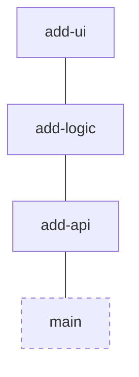

# Core Concepts

Understanding these concepts will help you work effectively with stackit.

## Stacks

A **stack** is a set of branches that build on top of each other. Each branch contains a focused change, and together they form a larger feature.



### Linear stacks

The simplest form is a linear chain:

```
● add-ui
│
◯ add-logic
│
◯ add-api
│
main
```

### Tree structures

Stacks can branch when you have parallel work:

```
◯ add-tests
│
│ ◯ add-ui
├─┘
◯ add-logic
│
◯ add-api
│
main
```

## Parents and children

Each branch in a stack has a **parent** (the branch it's based on) and may have **children** (branches based on it).

- **Parent**: The branch that this branch builds on top of
- **Children**: Branches that build on top of this branch

View relationships with:

```bash
stackit parent    # Show parent branch
stackit children  # Show child branches
```

## Trunk branch

The **trunk** is your main development branch (usually `main` or `master`). All stacks eventually connect back to trunk.

Return to trunk with:

```bash
stackit trunk
```

## Tracked vs untracked branches

Stackit only manages branches that are **tracked**. Branches created with $$stackit create$$ are automatically tracked.

To track an existing branch:

```bash
stackit track
```

To stop tracking a branch:

```bash
stackit untrack
```

## Restacking

When you modify a branch in the middle of a stack, all child branches need to be rebased. This is called **restacking**.

```bash
stackit restack
```

Stackit automatically rebases all affected branches to maintain the stack structure.

## Metadata

Stackit stores metadata about each branch in Git refs under `refs/stackit/metadata/`. This includes:

- Parent-child relationships
- PR information (number, title, base branch)
- Branch scope (Jira ticket, Linear ID, etc.)
- Lock/freeze status

You don't need to manage this directly—stackit handles it automatically.

## Frozen vs locked branches

### Frozen (local only)

**Frozen** branches are protected locally on your machine:

- Use for branches you've fetched from others
- Prevents accidental modification
- Not shared with collaborators

```bash
stackit freeze <branch>
stackit unfreeze <branch>
```

### Locked (shared)

**Locked** branches are protected for everyone:

- Shared via remote metadata
- Signals stability to your team
- Prevents modifications by all users

```bash
stackit lock <branch>
stackit unlock <branch>
```

Both prevent operations like $$stackit modify$$, $$stackit squash$$, $$stackit absorb$$, and $$stackit restack$$.

!!! tip "Git hooks"
    Install [Git hooks](../integrations/git-hooks.md) to prevent commits and pushes to locked branches at the Git level.

## Worktrees

**Worktrees** let you work on multiple stacks simultaneously in separate directories.

Create a branch with a worktree:

```bash
stackit create my-feature -w -m "feat: new feature"
```

This creates:

- A new tracked branch `my-feature`
- A worktree at `../your-repo-stacks/my-feature/`

Navigate to worktrees:

```bash
# With shell integration: auto-changes directory
stackit worktree open my-feature

# Without shell integration: use command substitution
cd $(stackit worktree open my-feature)
```

## Scopes

**Scopes** are logical identifiers (Jira tickets, Linear IDs, etc.) associated with branches.

Set a scope:

```bash
stackit scope PROJ-123
```

Stackit can use scopes for:

- Grouping related branches
- Naming new branches automatically
- Organizing PRs

## Next steps

- [Workflows →](../workflows/index.md)
- [Explore the CLI reference →](../cli/reference.md)
