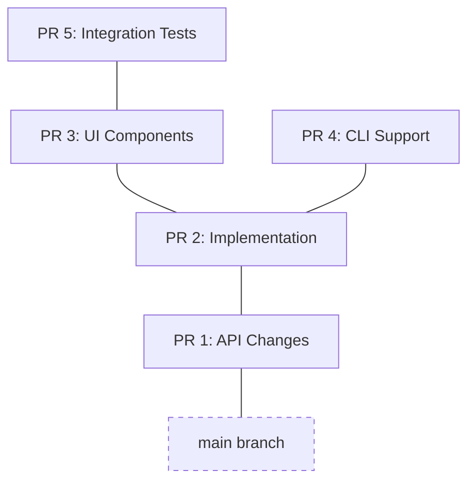

# stackit

**stackit** is a command-line tool that makes working with stacked changes fast and intuitive.

-   :octicons-stack-24:{ .lg .middle } **Visual branch tree**

    ---

    See your entire stack at a glance with $$stackit log$$

-   :material-refresh-auto:{ .lg .middle } **Automatic restacking**

    ---

    Keep all branches up to date when you rebase or modify a parent

-   :material-upload-multiple:{ .lg .middle } **Submit entire stacks**

    ---

    Push all branches and create/update PRs in one command

-   :material-merge:{ .lg .middle } **Smart merging**

    ---

    Merge stacks bottom-up or squash top-down with intelligent workflows

-   :material-robot:{ .lg .middle } **Claude Code integration**

    ---

    Generate integration files for AI assistants with context-aware commands

-   :simple-github:{ .lg .middle } **GitHub integration**

    ---

    Install CI checks to prevent merging locked PRs

## What is stacking?

Stacked changes (or "stacked diffs") is a development workflow where you break a large feature into small, focused branches that build on top of each other. Instead of one massive Pull Request, you have a "stack" of smaller PRs.

!!! tip "Why use stacking?"

    - **Faster Reviews**: Reviewers can process small, 50-line PRs much faster than a single 500-line PR
    - **Parallel Work**: Don't wait for a PR to merge before starting the next part of your feature
    - **Incremental Shipping**: Parts of a feature can be merged and deployed as they are approved
    - **Cleaner History**: Each PR represents a logical step in your feature's development

### The Stacked Workflow

Stacks naturally form a tree structure—a single branch can have multiple children when you need to work on parallel features. Stackit manages the complexity of this workflow—automatically handling rebases, keeping track of parent-child relationships, and submitting the entire stack to GitHub with a single command.

## Quick start

Get started with stackit in minutes:

[Get started](start/index.md){ .md-button .md-button--primary }
[Installation](start/install.md){ .md-button }

## Need help?

- Read the [User Guide](guide/index.md) to learn core concepts
- Check [Workflows](workflows/index.md) for examples
- Explore the [CLI Reference](cli/reference.md) for all commands
- Visit [FAQ](community/faq.md) for frequently asked questions
